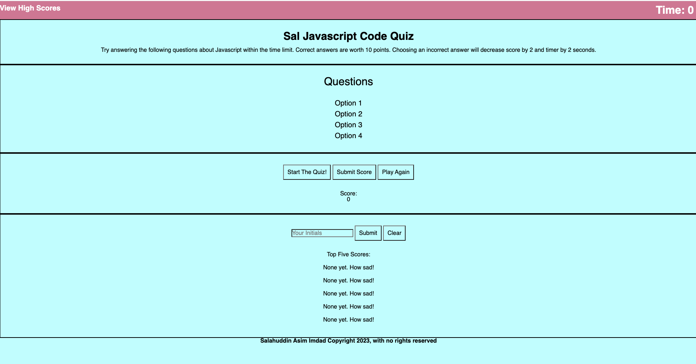

# Sal-Code-Quiz

## Description

This is a Quiz on basic Javascript knowledge. The purpose of building this wepage is demonstrate my growing knowledge of Css and Javascript.

## Table of Contents 

- [Usage](#usage)
- [Credits](#credits)
- [License](#license)
- [Features](#features)
- [Contribution](#contribution)
- [Questions](#questions)

## Usage
  

- The deployed webpage can be viewed at this link: https://sal8298.github.io/Sal-Code-Quiz/
        
- Here is a screenshot of the site:

## Credits

- Garrett Winter (https://github.com/garrettWinter)
- Nicholas Mamberger https://github.com/NickHM05

## License

MIT License

## Features

Some notable items for this project are:
- Buttons are controlled dynmaically so the apopriate button is always visible
- Scores are store in localstorage.

## Contribution

* To contribute you may reach me via email at sal@email.com.

## Questions

[Link to my Github profile](https://github.com/Sal8298)
Any Questions? If so, you can reach out to me at sal@email.com.

   